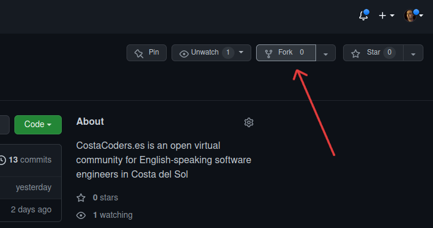
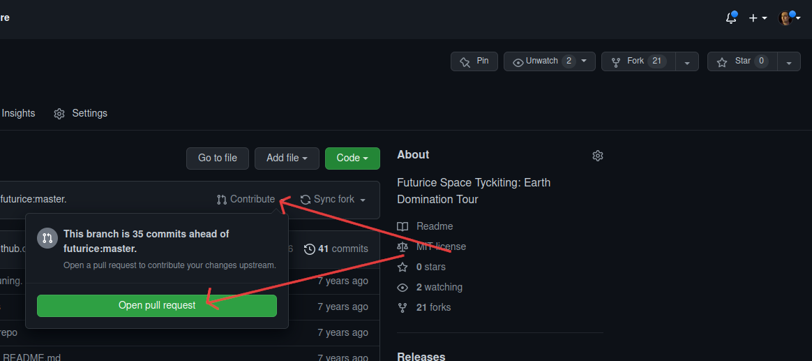

## CostaCoders.es

This is an open and collaborative community of English-speaking software engineers living in Costa del Sol area.

[Homepage](https://costacoders.es)

Take part! Add yourself or your open source project to feature to the site by making a pull request here!

You only need to click fork to clone this repository to your own profile, then make the edits you want (you know how to use Git or else you wouldn't be here).



To edit, just duplicate a file in the `content/coders/` or `content/projects` directory to another name and adapt accordingly.

To test the site locally, you can clone it, [install Hugo](https://gohugo.io/getting-started/installing/) and then:
```
git submodule update --remote
hugo serve
```

When you have done your edits and pushed them to your own GitHub fork, then click "Contribute" and "Open pull request" from your fork on GitHub.


